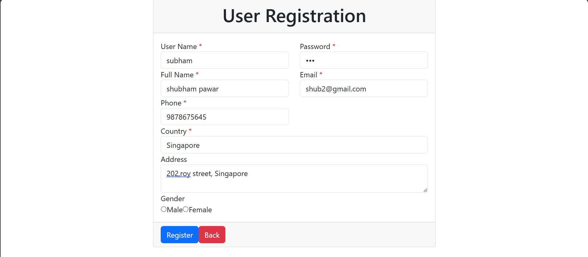
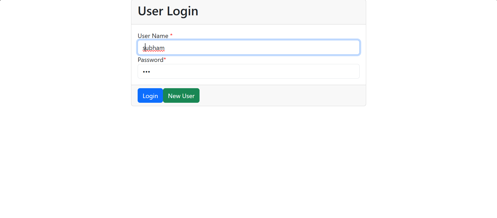

# **React Application with Role-Based Access Control (RBAC)**

*Effortlessly manage access levels with a robust and scalable React application.*

---

## **Overview**
This project demonstrates how to implement Role-Based Access Control (RBAC) in a React application. It uses `JSON Server` as a mock backend to manage user roles, permissions, and API responses for seamless prototyping and development.

---

## **Features**
- 🔒 **Role-Based Access Control**: Granular control over user access based on roles (`Admin`, `Editor`, `Viewer`).
- ⚡ **Mock Backend**: Powered by JSON Server for rapid prototyping.
- 💻 **Dynamic Rendering**: Conditionally render UI components based on user roles.
- 📊 **Scalable Design**: Modular and reusable code structure.
- 🎨 **User-Friendly Interface**: A clean and responsive layout for better usability.

---

## **Demo**

### **Register**
  

### **Login**
  

### **Access Dashboard**
  
*Admins and user can access specific features.*

---

## **Getting Started**

### **1. Prerequisites**
Ensure you have the following installed:
- Node.js (>= 14.x)
- npm (>= 6.x)

---

### **2. Installation**

Clone this repository and install dependencies:

```bash
git clone https://github.com/your-username/react-rbac-app.git
cd react-rbac-app
npm install
